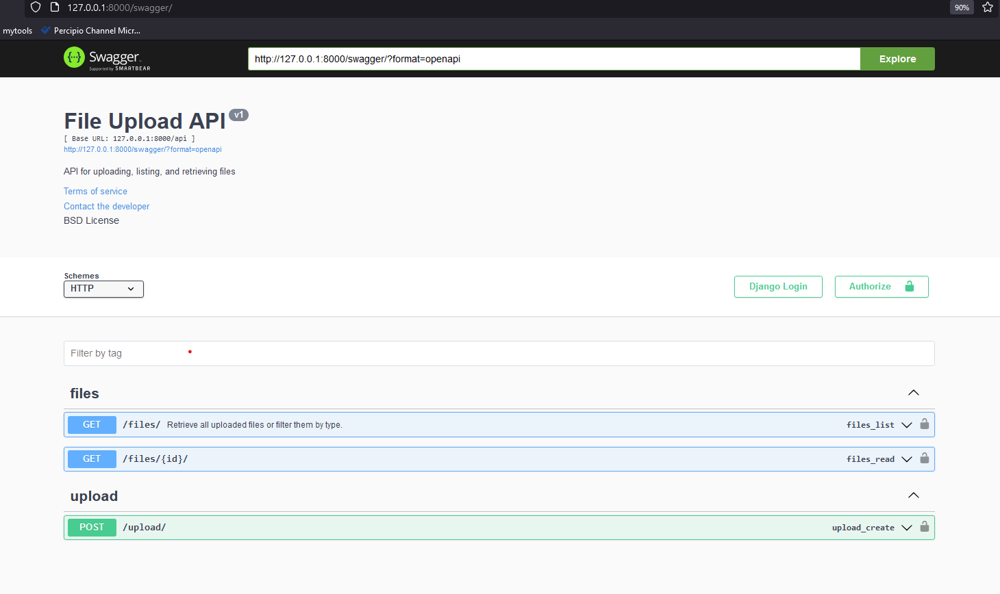
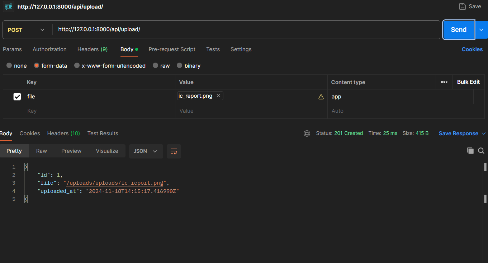
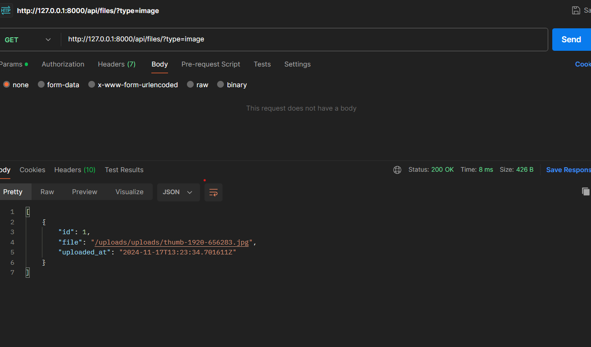

# Installation

    clone the repo 
    install the requirements.txt
    python manage.py makemiragtions
    python manage.py makemiragtions
    #to run test cases
    pytest 
    #to view apis
    python manage.py runserver
    user : http://127.0.0.1:8000/swagger/  

# swagger : 

# postman - post  

#  postman - post  
